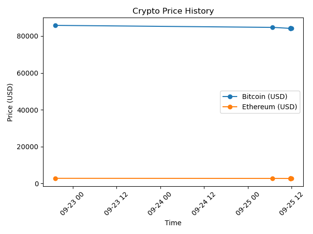

# Live Crypto Price ETL Pipeline

An end-to-end data pipeline that pulls live cryptocurrency prices, stores historical data in MySQL, and analyzes trends using SQL.

## What it does

- **Extract:** Pulls live Bitcoin and Ethereum prices (USD + INR, plus 24h % change) from the [CoinGecko API](https://www.coingecko.com/en/api)
- **Load:** Inserts each pull into a MySQL database, timestamped, so history accumulates over time
- **Automate:** Runs automatically every 3 hours via cron
- **Analyze:** SQL queries — including `RANK()` and `PARTITION BY` — surface highest/lowest prices, price swings, and trends
- **Visualize:** A Python script (`plot_prices.py`) charts price history using matplotlib

## Tech stack

Python, MySQL, cron, matplotlib, CoinGecko API

## Architecture

CoinGecko API → Python (requests) → MySQL → SQL analysis + matplotlib chart, triggered every 3 hours by cron

## Sample chart



*Note: prices look relatively flat in this sample — most data points were captured close together during testing. Over a longer running window, real price movement becomes visible.*

## Design decisions & tradeoffs

- **Cron over Airflow:** Airflow requires its own server/database to run, which is heavy infrastructure for a project this size. Cron fits the scale here; a production system with multiple dependent pipeline steps would justify Airflow's added complexity.
- **MySQL over a data warehouse:** A true warehouse (Snowflake/BigQuery) is built for large-scale analytical workloads. At this data volume, MySQL is sufficient and keeps the project simple; at scale, this would move to a proper warehouse.
- **Local cron limitation:** Since cron runs on a personal laptop rather than an always-on server, scheduled runs are skipped if the machine is asleep. In production, this pipeline would run on a cloud VM or server to guarantee uptime.

## Security

Database credentials are stored in a `.env` file (excluded from version control via `.gitignore`) and never hardcoded.

## Setup

1. Clone this repo
2. Create a `.env` file with `DB_PASSWORD=your_password`
3. Run `pip install -r requirements.txt`
4. Create the MySQL database/table (see schema below)
5. Run `python fetch_crypto.py` to pull data manually, or set up the cron job for automatic runs

## Database schema

```sql
CREATE TABLE crypto_prices (
    id INT AUTO_INCREMENT PRIMARY KEY,
    coin VARCHAR(20),
    price_usd DECIMAL(18,2),
    price_inr DECIMAL(18,2),
    change_24h_percent DECIMAL(6,2),
    recorded_at DATETIME
);
```
